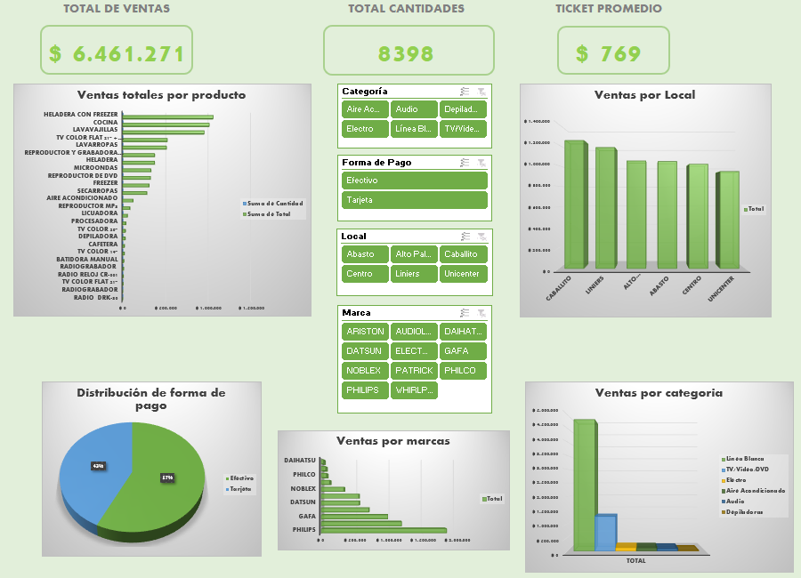
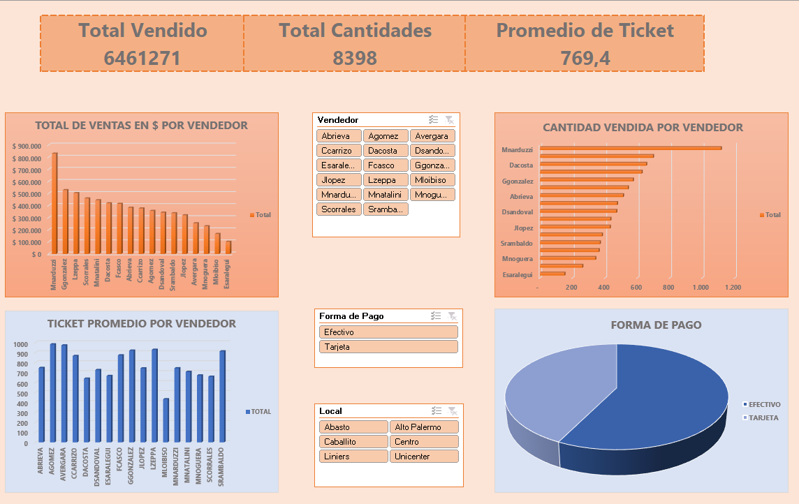

# 📊 Portfolio de Dashboards en Excel

Bienvenida/o a mi portfolio de dashboards interactivos desarrollados 100% en Excel.

---

## 🧩 ¿Qué incluye este archivo?

📁 **Análisis de ventas comerciales.xlsx**  
Contiene dos dashboards:

1. **Dashboard Comercial**
   - Análisis de ventas por producto, local, forma de pago y marca.
   - KPIs dinámicos, segmentadores, gráficos variados y diseño profesional.
   
2. **Dashboard de Vendedores**
   - Ranking por ventas y cantidad.
   - Ticket promedio por vendedor.
   - Segmentación por local, forma de pago y vendedor.

⚙️ Las hojas con cálculos y tablas dinámicas están ocultas para mantener la presentación limpia. Todo está automatizado con segmentadores y KPIs dinámicos.

---

## 📸 Vistas previas

### Dashboard Comercial

### Dashboard de Vendedores

---

🎯 **Herramientas utilizadas:**
- Excel 2019
- Tablas dinámicas
- Segmentadores
- Gráficos avanzados
- Paletas de color personalizadas
